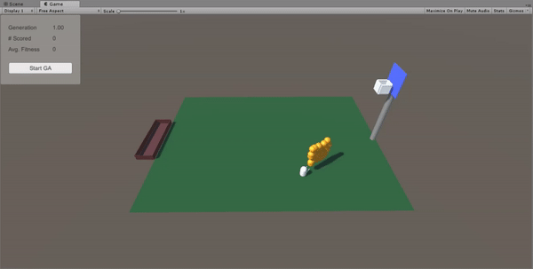
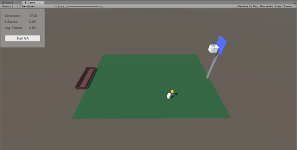

#H1 Basketball Shooting

This Unity project uses a genetic algorithm to identify a successful basketball shot from any position in a basketball court.

#H2 Demonstration

First Generation: 

100% Score Generation: 

#H2 Details

Genetic algorithms involve generating a population of random solutions, and evolving these solutions according to a specific goal. These solutions are represented as chromosomes. In this scenario, chromosomes represent solutions of basketball shots. Chromosomes include two parameters, namely:

1. An upward force; and
2. A forward force.

The upward force and forward force parameters are used to specify the force applied to the ball on the y-axis and z-axis (forward) respectively.

Chromosomes are evaluated by processing a basketball shot with its parameters after a specified duration. Fitness is a term used to describe the strength of the solution. The fitness of chromosomes are evaluated based on two factors, namely:

1. The closest distance between the basketball and the basket during the evaluation; and
2. If the basketball had successfully been scored in the basketball hoop.
